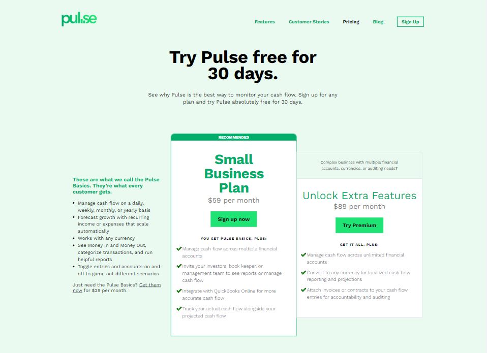
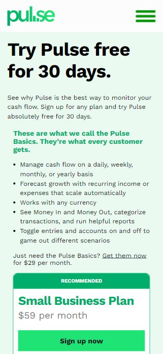

# Pulse Clone - Frontend Practice

Clone webpage of [Pulse](https://pulseapp.com/pricing) site, made as a Level 1 challenge on [Frontend Practice](https://www.frontendpractice.com/projects/pulse). Challenge is to recreate the first page only, as better as you can, with colors and free icon assets given. Also, there are helpful articles and resources for beginners that are new to HTML and CSS. I've gone a step further, by making this responsive too, with a hamburger menu.

## Table of contents

- [Overview](#overview)
  - [Screenshot](#screenshot)
  - [Links](#links)
- [Process](#process)
  - [Built with](#built-with)
- [Author](#author)

## Overview

Users should be able to:
- see the real site via link in this README, and my clone. 
- click on the links in the clone that will navigate them to the real Pulse pages
- open a nav via hamburger menu in mobile version

### Screenshot

Desktop and mobile design of Pulse clone.

### Links

- Live Site URL: [Pulse Clone](https://jelenkoo10.github.io/pulse)

## Process

### Built with

- Semantic HTML5 markup
- CSS custom properties
- Flexbox
- CSS Grid
- DOM Manipulation
- Desktop-first workflow
- [GSAP](https://greensock.com/gsap/) - JS animation library

## Author

- GitHub - [https://github.com/jelenkoo10](https://github.com/jelenkoo10)
- Frontend Mentor - [@jelenkoo10](https://www.frontendmentor.io/profile/jelenkoo10)
- LinkedIn - [Veljko Jelenković](https://www.linkedin.com/in/veljko-jelenkovi%C4%87-182981250/)
